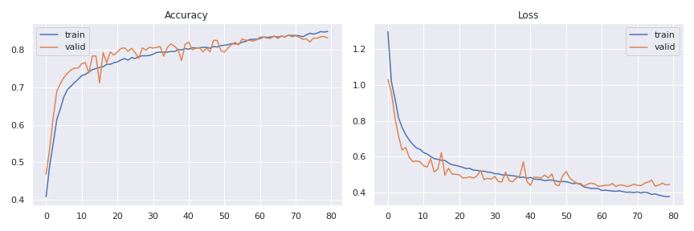
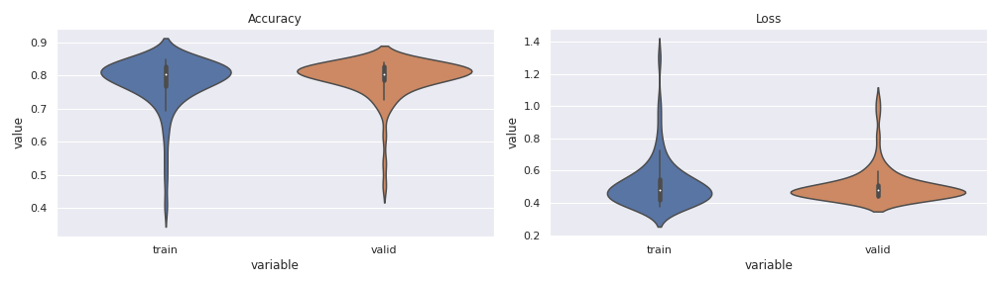
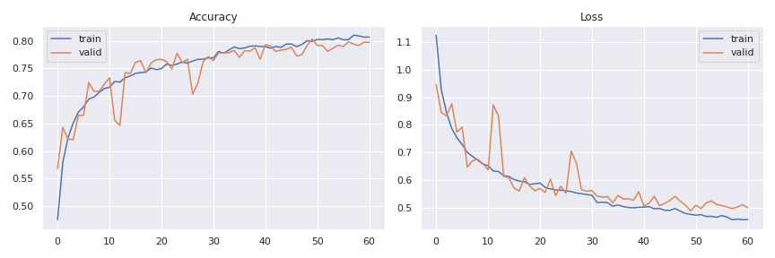
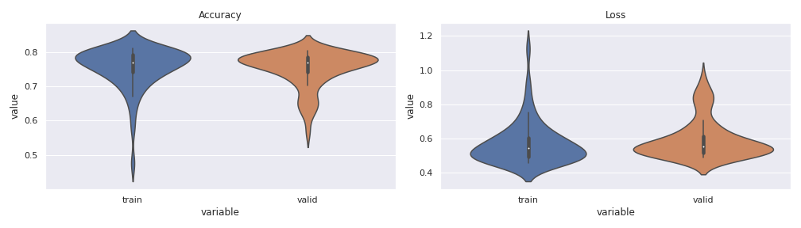
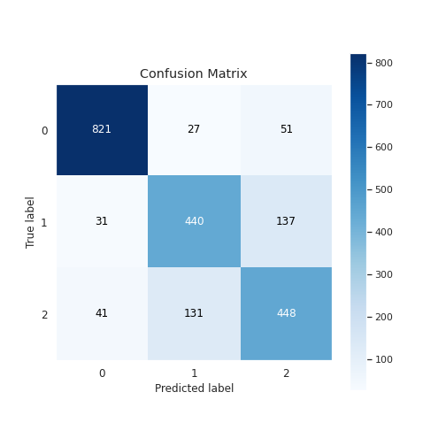
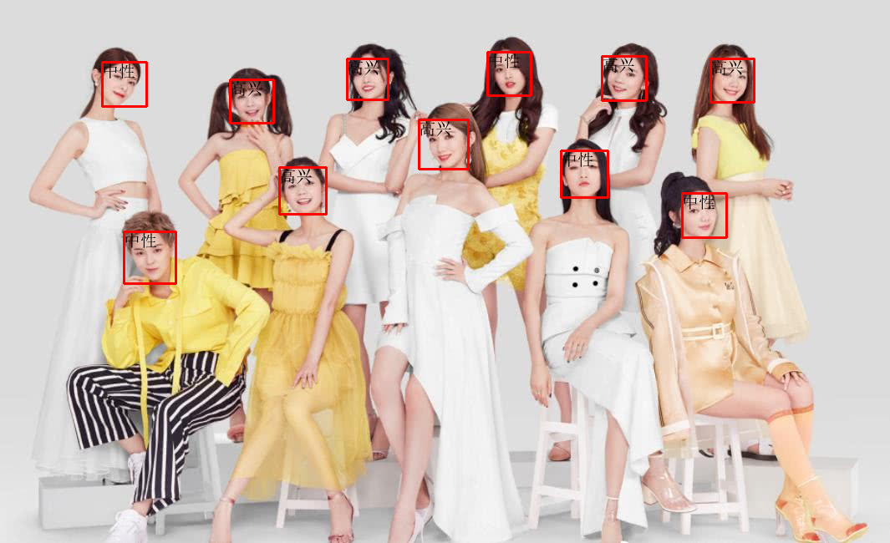

## 介绍
使用图片进行表情识别，网络架构为DCNN和mini_xception，数据集为fer2013。  
分成7类时，准确率较低，只有70%；而分成3类时，准确率达到80%。

这是在kaggle上使用云GPU训练的，结果如下：

 

  

 
 
  

这些网络结构都是别人写的，实际上我也不会去设计神经网络架构，我只会应用它；
一个应用是使用该网络去识别图片，效果如下，另一个是使用它去对视频识别，或者开启摄像头识别（实时识别）。

 
 
  

## 视频
<https://www.bilibili.com/video/BV1Jw411R7ca>

## 关于复现代码
- 要把代码里面的路径改一下，否则会报错。
- 换成更好的数据集，提升准确率
- 修改神经网络架构，提升准确率
